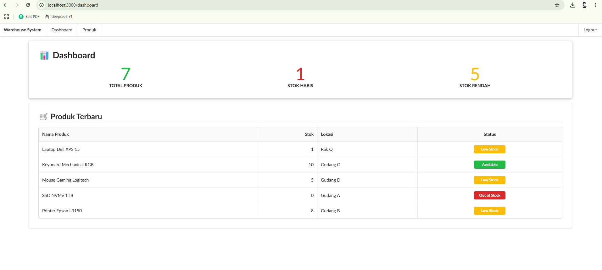
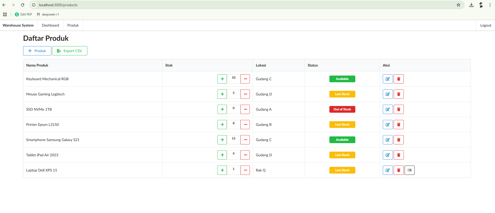
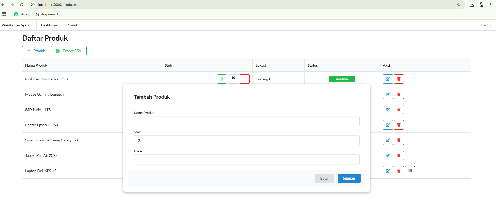
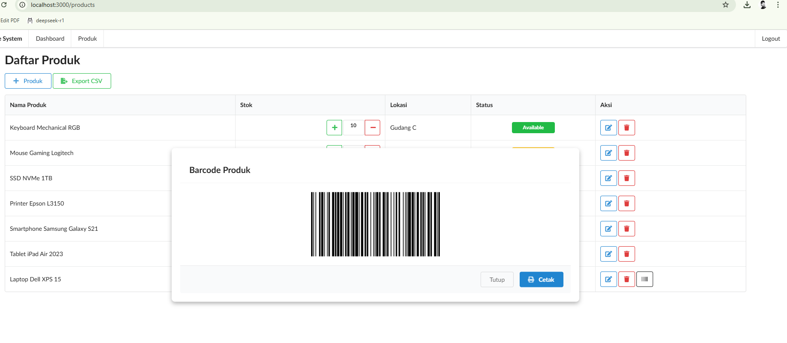
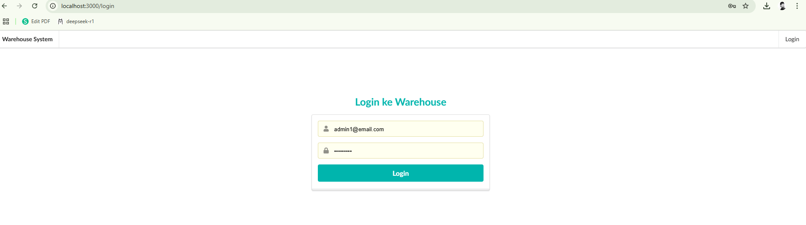

# Simple Warehouse Management System - Frontend

Ini adalah proyek frontend dari **Simple Warehouse Management System** menggunakan **Nuxt.js** dan **Fomantic-UI**.

## 🛠️ Instalasi dan Menjalankan Proyek

### 1. Clone Repository
```sh
git clone https://github.com/adipras/warehouse-frontend.git
cd <repository-folder>
```

### 2. Install Dependencies
```sh
npm install
```

### 3. Menjalankan Proyek
```sh
npm run dev
```
Aplikasi akan berjalan di `http://localhost:3000/` secara default.

## ⚙️ Konfigurasi Environment
Buat file `.env` di root proyek dan tambahkan:
```sh
NUXT_PUBLIC_API_BASE=http://localhost:8080/api
```
Ubah sesuai dengan konfigurasi backend yang digunakan.

## 📌 Fitur Utama
✅ **Autentikasi** (Login & Logout dengan JWT)  
✅ **CRUD Produk** (Tambah, Edit, Hapus Produk)  
✅ **Manajemen Stok** (Tambah/Kurangi stok langsung dari daftar produk)  
✅ **Status Stok Otomatis** (Berdasarkan jumlah stok)  
✅ **Lihat dan Cetak Barcode SKU**  
✅ **Ekspor Data Produk ke CSV**  

## Sceenshot






